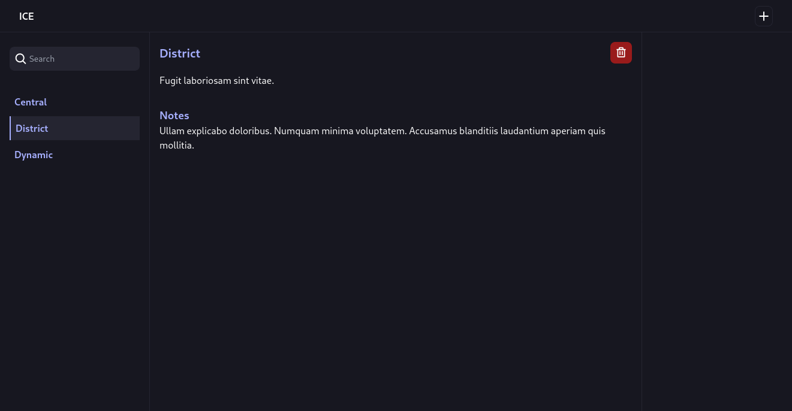

<br/>
<p align="center">
  <a href="https://github.com/calvin-kimani/Ice">
    
  </a>

  <h3 align="center">ICE</h3>

  <p align="center">
    Chilling Cybersecurity Documentation
    <br/>
    <br/>
    <a href="https://github.com/calvin-kimani/Ice"><strong>Explore the docs »</strong></a>
    <br/>
    <br/>
    <a href="https://github.com/calvin-kimani/Ice">View Demo</a>
    .
    <a href="https://github.com/calvin-kimani/Ice/issues">Report Bug</a>
    .
    <a href="https://github.com/calvin-kimani/Ice/issues">Request Feature</a>
  </p>
</p>

      

## Table Of Contents

* [About the Project](#about-the-project)
* [Built With](#built-with)
* [Getting Started](#getting-started)
  * [Prerequisites](#prerequisites)
* [Roadmap](#roadmap)
* [Contributing](#contributing)
* [License](#license)
* [Authors](#authors)
* [Acknowledgements](#acknowledgements)

## About The Project




Introducing Ice, the cutting-edge web application crafted specifically for cybersecurity documentation needs.

In the realm of cybersecurity, meticulous documentation is paramount. Ice streamlines this process, providing an intuitive and visually captivating interface that enhances productivity and efficiency. Say goodbye to cumbersome documentation practices and hello to a seamless experience designed to meet the demands of modern cybersecurity workflows.

Why should cybersecurity professionals choose Ice?

* Efficiency Redefined: With Ice, mundane documentation tasks become effortless. Its user-friendly interface and intuitive features allow for quick and streamlined documentation processes, freeing up valuable time for focusing on critical security matters.
* Visual Appeal: Gone are the days of uninspiring documentation platforms. Ice leverages the power of Tailwind CSS to deliver a visually stunning experience that not only enhances usability but also makes documentation a pleasure rather than a chore.
*  Security at its Core: As guardians of sensitive information, cybersecurity professionals understand the importance of robust security measures. Ice prioritizes security, employing industry-leading practices to safeguard your data and ensure compliance with stringent security standards.
*  Future-Proofed Development: While still in development, Ice is poised to revolutionize the way cybersecurity documentation is handled. Continuously evolving and incorporating feedback from industry experts, Ice promises to stay ahead of the curve and adapt to the ever-changing landscape of cybersecurity.

In summary, Ice is not just another documentation tool—it's a game-changer for cybersecurity professionals. Experience the future of cybersecurity documentation with Ice and elevate your security practices to new heights.

## Built With

1. Laravel: Ice is powered by Laravel, a robust PHP framework renowned for its elegant syntax and powerful features. Laravel provides the foundation for Ice's backend functionality, enabling smooth data management and efficient processing of security documentation tasks.

2. Tailwind CSS: Ice utilizes Tailwind CSS, a highly customizable CSS framework, to create its sleek and visually appealing user interface. Tailwind CSS facilitates rapid development with its utility-first approach, allowing for seamless integration of design elements and ensuring a delightful user experience.

3.MySQL Database: Ice relies on MySQL, a popular open-source relational database management system, for storing and managing structured data related to cybersecurity documentation. MySQL offers scalability, reliability, and robust performance, essential for handling the demands of security documentation workflows.


## Getting Started


1. Clone the Repository:
```bash
    git clone https://github.com/calvin-kimani/Ice.git
    cd ice
```
2. Install Dependencies:
```bash
    composer install
    npm install
```

3. Configure Environment Variables:
        Rename .env.example to .env.
        Set up your database connection details in the .env file.

4. Generate Application Key:
```bash
    php artisan key:generate
```

5. Compile Assets:
```bash
    npm run dev
```

6. Run Migrations:
```bash
    php artisan migrate
```

7. Start the Development Server:
```bash
    php artisan serve
```
Access Ice in Your Browser: Open your browser and navigate to http://localhost:8000.

### Prerequisites

1. Npm
2. MySql
3. Composer
4. Php

## Roadmap

See the [open issues](https://github.com/calvin-kimani/Ice/issues) for a list of proposed features (and known issues).

## Contributing

Contributions are what make the open source community such an amazing place to be learn, inspire, and create. Any contributions you make are **greatly appreciated**.
* If you have suggestions for adding or removing projects, feel free to [open an issue](https://github.com/calvin-kimani/Ice/issues/new) to discuss it, or directly create a pull request after you edit the *README.md* file with necessary changes.
* Please make sure you check your spelling and grammar.
* Create individual PR for each suggestion.
* Please also read through the [Code Of Conduct](https://github.com/calvin-kimani/Ice/blob/main/CODE_OF_CONDUCT.md) before posting your first idea as well.

### Creating A Pull Request

1. Fork the Project
2. Create your Feature Branch (`git checkout -b feature/AmazingFeature`)
3. Commit your Changes (`git commit -m 'Add some AmazingFeature'`)
4. Push to the Branch (`git push origin feature/AmazingFeature`)
5. Open a Pull Request

## License

Distributed under the MIT License. See [LICENSE](https://github.com/calvin-kimani/Ice/blob/main/LICENSE.md) for more information.

## Authors

* **Calvin Kimani** - *Computer Technology Student* - [Calvin Kimani (wolf)](https://github.com/calvin-kimani/) - *Creator of Ice*

## Acknowledgements

